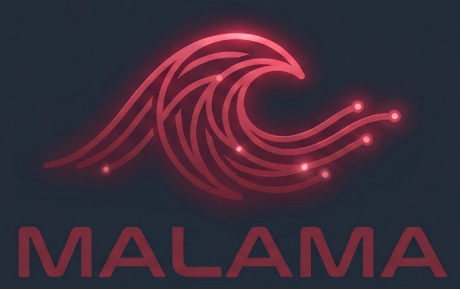
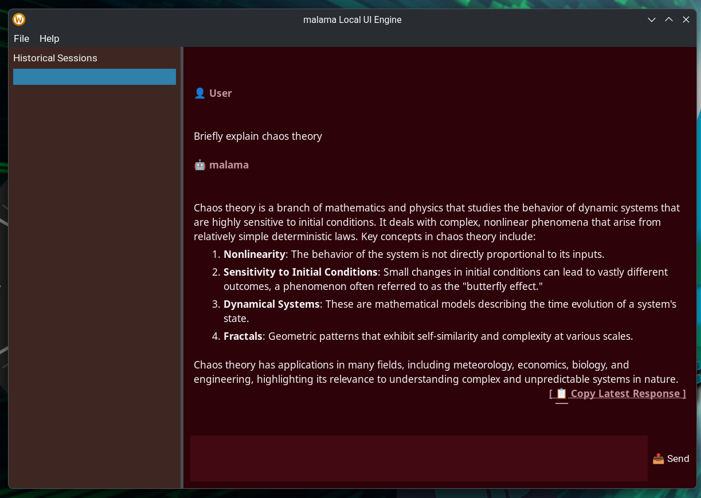

# Malama

> Native Linux chat client for local LLMs — no cloud, no browser, no compromise.

[](LICENSE)
[](#)
[](#)
[](#)


---



## 🚀 Key Features

* **Ultra-Minimalist Footprint:** Idles at ~20MB of RAM. Bypasses bloated Electron wrappers, ensuring your hardware resources are strictly dedicated to model inference.
* **Persistent Sessions (New in v0.2.0):** Native sidebar management. Pin, rename, delete, and instantly switch between historical chats without memory spikes.
* **Native Markdown & Syntax Highlighting (New in v0.2.0):** Custom, zero-dependency Markdown pipeline featuring a dynamic, JSON-pluggable syntax registry (Semantic highlighting for C++, Rust, Python, JavaScript, CSS, and more).
* **Low-Latency Streaming:** Asynchronous, non-blocking TCP socket implementation for real-time code and text generation.
* **Privacy-Focused:** A local-first architecture—your data never leaves your machine.

---

## 🎥 Introduction

See **malama** v0.2.0 in action:

[Video of using_malamav0.2.0]
<video width="640" height="360" controls>
  <source src="./assets/malama_v0.2.0.mp4" type="video/mp4">
  Your browser does not support the video tag.
</video>

[Watch the malama v0.2.0 introduction](./assets/malama_v0.2.0.mp4)

### The UI


---

## 🏗 Architecture & Engineering

`malama` is engineered for stability and speed. Key architectural pillars include:

* **Zero-Overhead Storage:** Employs an append-only JSON Lines (`.jsonl`) architecture. Paired with `glaze` for compile-time JSON reflection, reading and writing massive chat histories operates at O(1) memory allocation.
* **Dynamic Grammar Engine:** A custom state-machine driven Markdown parser that isolates syntax rules from the UI, allowing pluggable JSON grammar overrides without C++ recompilation.
* **Memory Safety:** Strict `std::nothrow` allocation strategy and smart pointer lifecycle management ensure the application remains stable under extreme system memory pressure.
* **Concurrency:** Uses dedicated background `std::jthread` workers and a `Boost.Asio` event loop to manage high-throughput socket communication and disk I/O without dropping UI frames.
* **Event-Driven UI:** Implements a decoupled, thread-safe global event bus (`wxQueueEvent`) for cross-thread GUI updates, completely avoiding race conditions.

---

## 🛠 Build Requirements

`malama` is designed exclusively for native Linux environments. You will need:

* **Compiler:** A C++23 compliant compiler (GCC 13+ or Clang 16+).
* **Dependencies:**
  * `wxWidgets` (3.2+ or 3.3)
  * `Boost.Asio` (Network/Concurrency)
  * `Boost.UUID` (Session ID Generation)
  * `spdlog` (Logging)
  * `glaze` (Compile-time JSON serialization)
* **Build System:** `CMake` (3.28+)

---

## ⚙️ Build Instructions

```bash
# Clone the repository
# Clone the repository
git clone https://github.com/Magpiny/malama.git
cd malama

# Configure and build
mkdir build && cd build
cmake ..
make -j$(nproc)

# Execute
./malama
