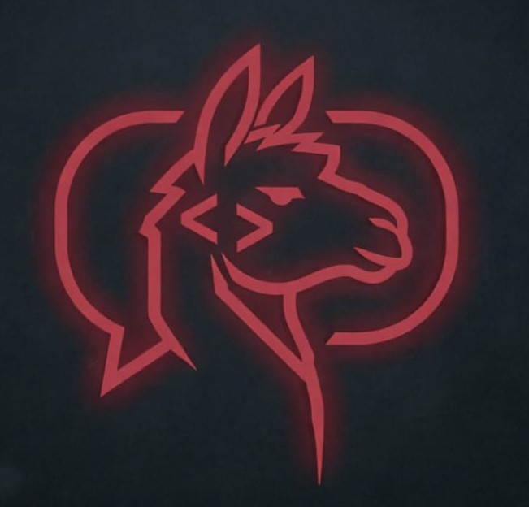
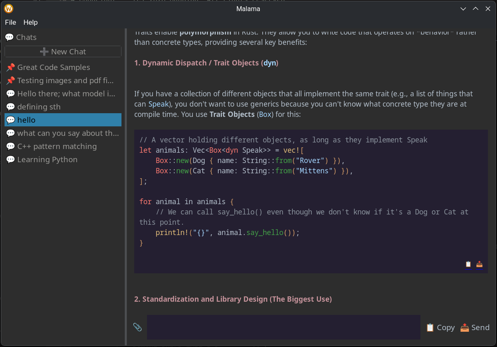

<div align="center">



# Malama

**Native Linux chat client for local LLMs — no cloud, no browser, no compromise.**

[](LICENSE)
[](#)
[](#)
[](#)
[](#)
[](#)

</div>

---



---

## Table of Contents

- [Overview](#overview)
- [What's New in v0.2.5](#whats-new-in-v025)
- [Key Features](#key-features)
- [Architecture](#architecture)
- [Build Requirements](#build-requirements)
- [Setup Guide](#setup-guide)
  - [1. Install Ollama](#1-install-ollama)
  - [2. Pull a Model](#2-pull-a-model)
  - [3. Build Malama](#3-build-malama)
- [Usage](#usage)

---

## Overview

**Malama** is a lightweight, native Linux desktop chat client built on wxWidgets and C++23.
It connects directly to a local [Ollama](https://ollama.com) instance over TCP, delivering
a full LLM chat workspace that idles at ~20 MB of RAM — with no Electron, no browser engine,
and no dependency on any external network.

---

## What's New in v0.2.5

### Dynamic Model Discovery
The hardcoded model name field is gone. Malama now queries the local Ollama
`/api/tags` endpoint at startup over a Boost.Asio TCP socket and populates a
`wxChoice` selector in the engine settings panel with every model currently
available on your system. Pull a new model with `ollama pull`, restart Malama,
and it appears automatically — no config file editing required.

### Reasoning Filter
Extended reasoning models (DeepSeek-R1, QwQ, and others) embed their chain-of-thought
inside `<think>` blocks that most users never need to read. A new toggle in the
preferences panel lets you suppress those blocks entirely. The filter runs on a
thread-isolated state machine so it never stalls streaming delivery.

### Non-Blocking Service Restarts
Changing engine parameters (model, context window, temperature) that require an
Ollama service restart no longer blocks the UI. A detached `std::jthread` handles
the `systemctl restart` call in the background; the interface stays fully
responsive throughout.

---

## Key Features

| | Feature | Description |
|---|---|---|
| 🪶 | **Minimal Footprint** | Idles at ~20 MB RAM. No Electron wrapper — hardware resources go to model inference, not the UI layer. |
| 💾 | **Persistent Sessions** | SQLite3-backed conversation history with pin, rename, and delete support. |
| 🔁 | **Session Restoration** | Automatically restores your last active conversation on startup. |
| ⚡ | **Low-Latency Streaming** | Non-blocking TCP streaming via Boost.Asio for real-time token delivery as the model generates. |
| 📝 | **Native Markdown** | Zero-dependency Markdown renderer with a JSON-pluggable syntax highlighting registry (C++, Rust, Python). |
| 🔒 | **Completion Hardening** | Completions are committed to disk before deallocation, preventing data loss on abrupt exit. |
| 🔍 | **Dynamic Model Discovery** | Queries the local Ollama `/api/tags` endpoint at startup; all available models populate a `wxChoice` selector automatically — no config editing. |
| 🧠 | **Reasoning Filter** | Preferences toggle to strip `<think>` blocks from extended reasoning models (DeepSeek-R1, QwQ, etc.) via a thread-isolated state machine. |

---

## Architecture

Malama is built around a clean separation between the UI thread, the background stream worker, and the storage layer.

**Storage Engine**
Parameterized SQLite3 queries protected by transaction guards across thread boundaries.
All object lifetimes are managed through `std::unique_ptr` — no raw owning pointers anywhere in the codebase.

**Stream Worker**
A background `StreamWorker` thread deserialises raw Ollama JSON responses via the
[`glaze`](https://github.com/stephenberry/glaze) compile-time reflection layer and
forwards terminal tokens to `MainFrame` via `wxQueueEvent`, keeping the UI thread
entirely free of blocking I/O.

**Model Discovery**
At startup, a Boost.Asio TCP socket queries `http://127.0.0.1:11434/api/tags` on
the local loopback. The JSON response is reflected via `glaze` and the resulting
model list is forwarded to the engine settings panel's `wxChoice` widget on the
main thread via `wxQueueEvent`. The entire sequence is distribution-agnostic —
it works regardless of how Ollama was installed.

**Config Bootstrap**
A thread-safe initialization sequence runs inside the main engine startup path,
pulling the active Ollama parameters (current model, context size, temperature)
before the first frame is rendered, so the UI opens already configured.

**Reasoning Filter**
A thread-isolated state machine in the `StreamWorker` tracks open and close
`<think>` tags in the token stream and suppresses the enclosed content when the
filter is enabled in preferences. The state is stored in an `std::atomic<bool>`
flag so the UI toggle takes effect immediately without restarting the stream.

**Service Restart Worker**
When the user changes a parameter that requires an Ollama restart, a detached
`std::jthread` issues the `systemctl restart ollama` call in the background.
The UI thread is never blocked; the preferences panel remains interactive throughout.

**Memory Policy**
Non-throwing allocation (`std::nothrow`) throughout.
No global mutable state. No raw owning pointers.

**Code Style**
K&R brace alignment, C++23 throughout.

---

## Build Requirements

Malama targets native Linux only.

### Compiler

- GCC 13+ **or** Clang 16+, with full C++23 support

### Dependencies

| Library | Version | Purpose |
|---|---|---|
| [wxWidgets](https://wxwidgets.org) | ≥ 3.2 | Native desktop UI framework |
| [SQLite3](https://sqlite.org) | any stable | Persistent conversation storage |
| [Boost.Asio](https://boost.org) | ≥ 1.74 | Async TCP streaming to Ollama |
| [Boost.UUID](https://boost.org) | ≥ 1.74 | Session identifiers |
| [Boost.Spirit X3](https://boost.org) | ≥ 1.74 | Compile-time PEG parser for the Markdown pipeline |
| [Boost.Regex](https://boost.org) | ≥ 1.74 | Pattern matching for the syntax highlighting engine |
| [spdlog](https://github.com/gabime/spdlog) | ≥ 1.12 | Structured logging |
| [glaze](https://github.com/stephenberry/glaze) | ≥ 2.0 | Compile-time JSON reflection |

### Build System

- CMake 3.28+

---

## Setup Guide

### 1. Install Ollama

Choose the option for your distribution.

#### Arch Linux / CachyOS

```bash
sudo pacman -S ollama
sudo systemctl enable --now ollama
```

#### Debian / Ubuntu

```bash
sudo apt install ollama
```

Or via Snap:

```bash
sudo snap install ollama
```

#### Fedora / RHEL

```bash
curl -fsSL https://ollama.com/install.sh | sh
```

#### All other distributions

```bash
curl -fsSL https://ollama.com/install.sh | sh
```

---

### 2. Pull a Model

Once the Ollama service is running, pull a model:

```bash
ollama pull llama3.2
ollama list      # verify it appears in the registry
```

Any model from [ollama.com/library](https://ollama.com/library) works.
Tested with `llama3.2`, `qwen2.5-coder`, and `mistral`.

---

### 3. Build Malama

#### Install system dependencies

**Arch / CachyOS**
```bash
sudo pacman -S cmake wxwidgets-gtk3 sqlite boost spdlog
```

**Debian / Ubuntu**
```bash
sudo apt install build-essential cmake libwxgtk3.2-dev \
                 libsqlite3-dev libboost-all-dev libspdlog-dev
```

#### Clone the repository

```bash
git clone https://github.com/Magpiny/malama.git
cd malama
```

#### Configure and build

```bash
mkdir build && cd build
cmake -DCMAKE_BUILD_TYPE=Release ..
cmake --build . -j$(nproc)
```

#### Run

```bash
./malama
```

---

## Usage

**Sending a prompt**
Type in the input field at the bottom of the window and press `Enter` or click **Send**.

**Session controls**
Right-click any entry in the sidebar to pin, rename, or delete that conversation.

**Switching sessions**
Click any sidebar entry to instantly restore that conversation exactly where you left off.

**Changing models**
Open **Settings → Engine** and select any model from the dropdown. The list is
populated live from your local Ollama instance — pull new models with `ollama pull`
and they appear on next launch.

**Reasoning filter**
Open **Settings → Preferences** and toggle **Filter reasoning blocks** to hide
`<think>` output from models like DeepSeek-R1 and QwQ. Takes effect immediately
without restarting the current session.

---

<div align="center">
  <sub>Built with C++23 · wxWidgets · Boost.Asio · Boost.Spirit(X3) - Boost.Regex - SQLite3 · glaze · spdlog</sub>
</div>
